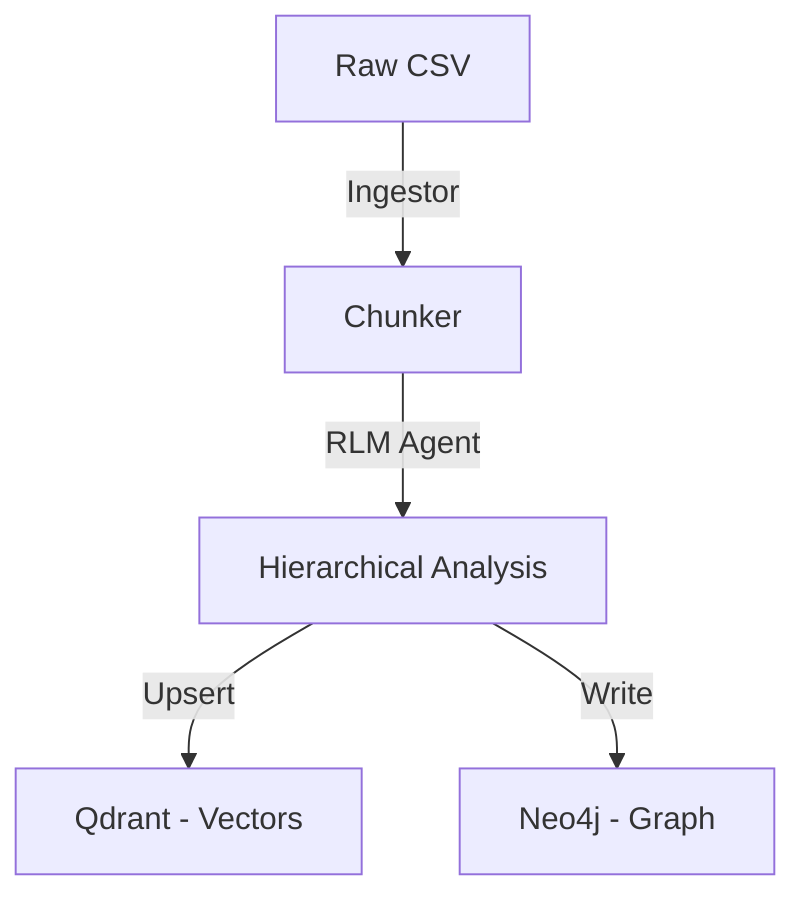
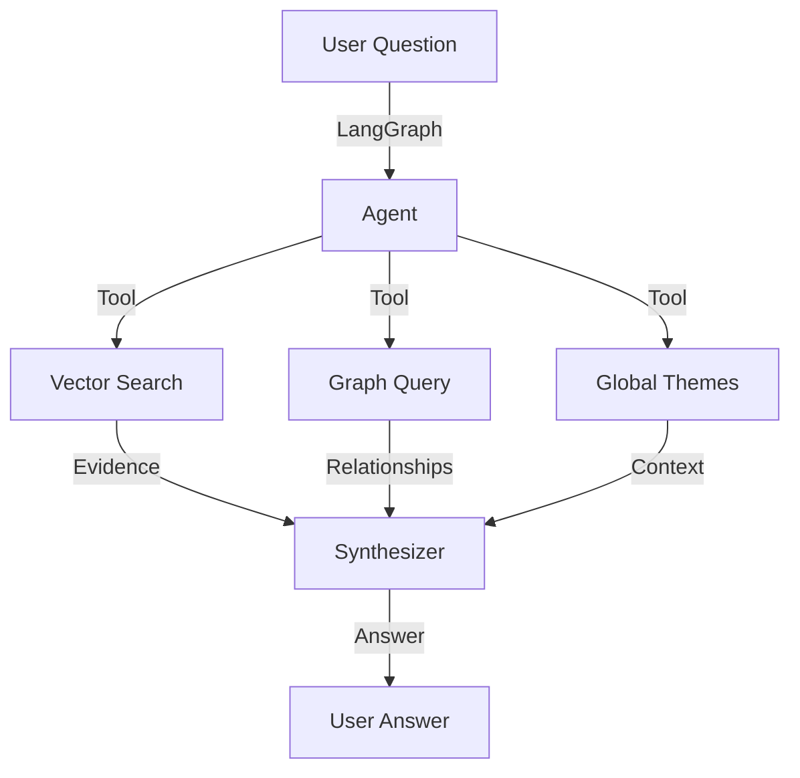

# Customer Intelligence Engine - Architecture (RLM-Powered)

## Core Philosophy: RLM vs Traditional RAG

### The Fragmentation Problem
**Traditional RAG suffers from "context fragmentation":**
- Documents split into chunks → Vector DB → Retrieve top-k → Answer
- ❌ Loses hierarchical relationships between chunks
- ❌ No understanding of document structure
- ❌ Fixed retrieval strategy
- ❌ Can't dynamically aggregate insights

### Our RLM Solution
**We use `dspy.RLM` (Recursive Language Model) to solve this:**
- LLM writes Python code to recursively process feedback.
- ✅ Maintains hierarchical context in data structures.
- ✅ Adaptive processing based on data characteristics.
- ✅ Transparent reasoning through code execution.
- ✅ Dynamic aggregation strategies.

---

## Layer Breakdown

### **Layer 1: Ingestion & Normalization** (`app/processing/ingestor.py`)
*   **Goal**: Unify data from any source into a standard format.
*   **Status**: ✅ Implemented
*   **Components**:
    *   `FeedbackChunker`: Intelligent splitting (1024 chars, 200 overlap).
    *   `IngestionService`: Orchestrates the flow from raw CSV to stored intelligence.

### **Layer 2: Vector Memory** (`app/memory/vector`)
*   **Goal**: Semantic search over raw chunks + RLM-generated summaries.
*   **Status**: ✅ Implemented (Qdrant Cloud)
*   **Components**:
    *   `VectorDatabase`: Stores chunks + hierarchical summaries.
    *   **Embeddings**: `all-MiniLM-L6-v2` (local, fast).
    *   **Usage**: Ground-truth verification + semantic search.

### **Layer 3: Hierarchical RLM Processing** (`app/processing/rlm_agent.py`) ⭐
*   **Goal**: Recursive code-based reasoning for hierarchical understanding.
*   **Status**: ✅ Implemented
*   **Key Innovation**: Uses `dspy.RLM` to dynamically decide the best grouping and summarization strategy.

#### How dspy.RLM Works:
1.  **Analysis**: LLM analyzes input data and metadata.
2.  **Code Generation**: LLM writes Python code using helper tools (Clustering, Summarization).
3.  **Execution**: Code groups similar feedback and recurses to generate "Meta-Summaries".
4.  **Synthesis**: Returns structured themes, critical issues, and a hierarchical summary.

### **Layer 4: Persistent Graph Memory** (`app/memory/graph`)
*   **Goal**: Map relationships between stable entities.
*   **Status**: ✅ Implemented (Neo4j)
*   **Components**:
    *   `Neo4jClient`: Manages graph transactions.
    *   **Schema**: `(User)-[:WROTE]->(Summary)-[:MENTIONS {sentiment}]->(EntityNode)`
    *   **EntityNode labels**: `Issue`, `Feature`, `Product`, `Entity`.

### **Layer 5: Agentic Orchestration** (`app/orchestration`)
*   **Goal**: Answer complex user questions using all memory layers.
*   **Status**: ✅ Implemented (LangGraph)
*   **Components**:
    *   **Agent**: LangGraph state machine (powered by `llama-3.1-8b-instant`).
    *   **Tools**:
        *   `search_vector_memory`: Semantic search (Layer 2).
        *   `query_graph_memory`: Relationship queries (Layer 4).
        *   `fetch_global_themes`: RLM aggregations (Layer 3) via `GlobalAggregator`.

---

## Data Flow Pipeline

### 1. Ingestion Flow:

### 2. Query Flow:

---

## Tech Stack

- **Backend**: FastAPI, DSPy, LangGraph
- **Frontend**: Next.js, TanStack Query, Radix UI, Lucide
- **Vectors**: Qdrant Cloud
- **Graph**: Neo4j Aura
- **LLM**: Groq (Llama-3.1-8B)
- **Embeddings**: Sentence-Transformers (Local)
